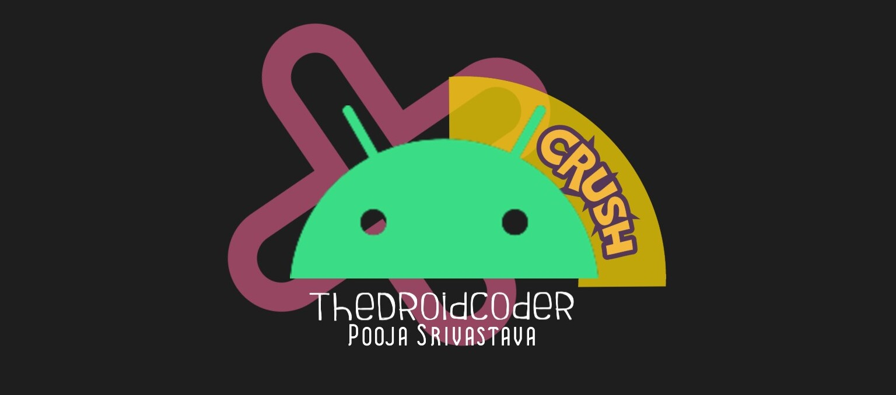
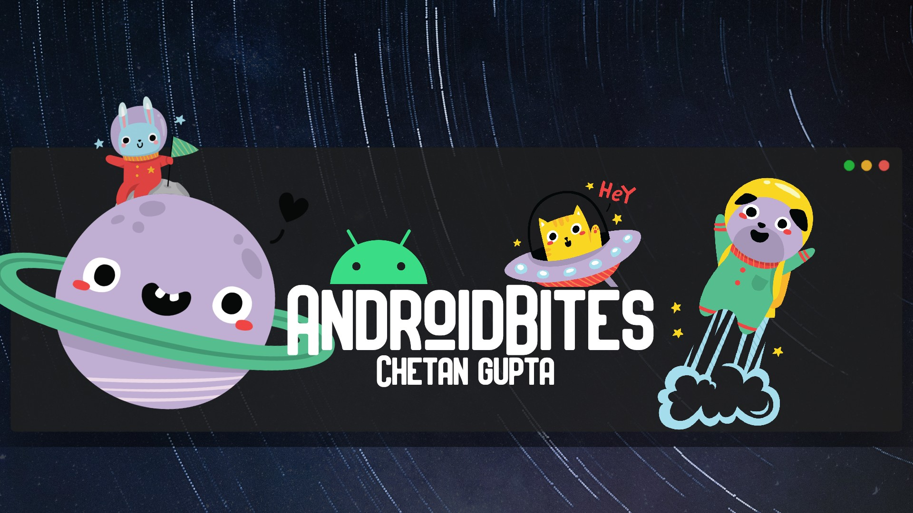

<h1 align="center"><a href="https://github.com/pooja-srivs" target="_blank">Guess the Color!</a>
</h1>

## :hand: About
Hello World! welcome to Guess the Color Repo, it's just a demo app for noobies to have a example of android app which is much
more than a hello world!

Made with Collab with [`Chetan Gupta`](https://chetangupta.net/about)

I'm Android dev and in free time help in content editor at [`AndroidBites|Big-Brain-Kotlin`](https://chetangupta.net/)

# :memo: TODO
* UI improvements
* test cases

# :lipstick: Social
[LinkedIn](https://www.linkedin.com/in/pooja-srivastava-30792aa1/) | 
[Medium](https://pooja-srivs.medium.com/) | 
[Twitter](https://twitter.com/pooja_srivs) | 
[Github](https://github.com/pooja-srivs) 

## :cop: License
Shield: [![CC BY-SA 4.0][cc-by-sa-shield]][cc-by-sa]

This work is licensed under a
[Creative Commons Attribution-ShareAlike 4.0 International License][cc-by-sa].

[![CC BY-SA 4.0][cc-by-sa-image]][cc-by-sa]

[cc-by-sa]: http://creativecommons.org/licenses/by-sa/4.0/
[cc-by-sa-image]: https://licensebuttons.net/l/by-sa/4.0/88x31.png
[cc-by-sa-shield]: https://img.shields.io/badge/License-CC%20BY--SA%204.0-lightgrey.svg
